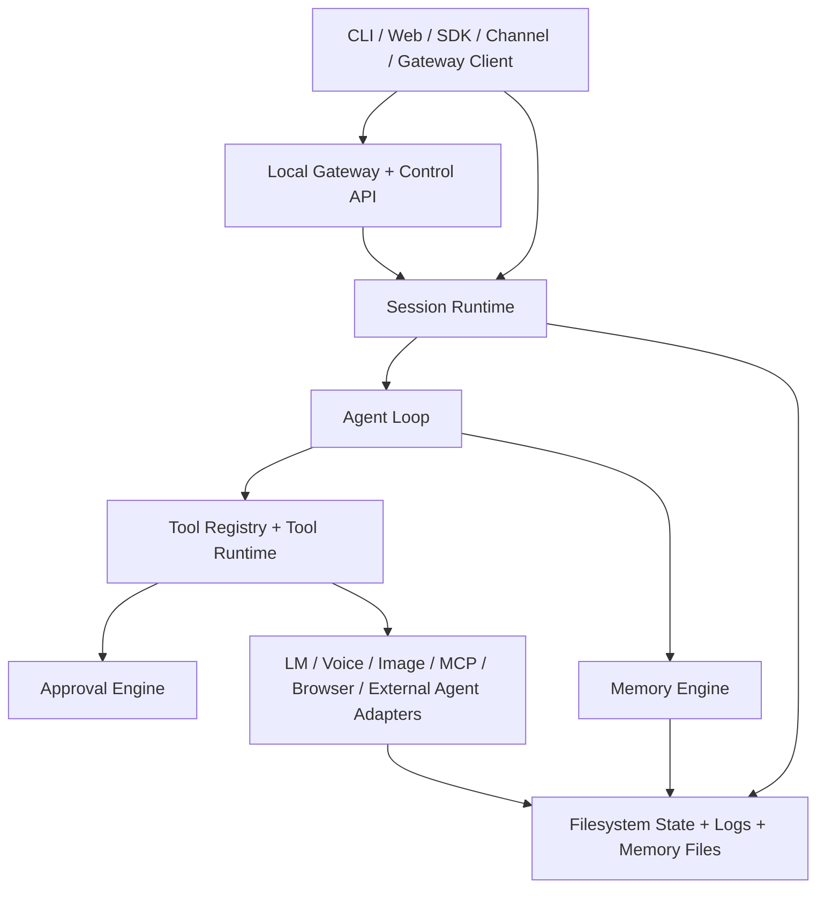

# AIAgent Initial Design

Last updated: 2026-03-31

## Status

This is the initial design baseline for the first implementation cycle of `AIAgent`.

It reflects the currently locked decisions from the planning dialogue plus the concrete implementation decisions that were resolved during the first build pass. The initial image-generation backend is now fixed as a ComfyUI-compatible local HTTP adapter, while the public interface remains provider-agnostic.

## Product Summary

`AIAgent` is a local-first AI agent product for coding and general-purpose work. It combines:

- a hardened agent loop for "work until task is complete"
- strong built-in tool descriptions and approval semantics
- Roo-Code-style explicit completion via `attempt_complete` tool usage
- Codex-style context engineering, AGENTS loading, skills, nudges, and steering
- Copilot-style approvals and chat/task control
- Mistral/OpenClaw-style memory compaction and durable memory layout
- VoltAgent-style MCP discovery and tool search
- OpenClaw-style local gateway, SDK, control UI, and messaging-channel control surfaces

Implementation order will still be sequential, but the intended scope is one broad MVP rather than a narrow core plus optional product tiers.

It is intentionally designed as:

- lightweight for its feature set
- highly modular
- provider-agnostic
- easy to port to another language because its core contracts are explicit and serialization-friendly

## Goals

- Build one codebase with shared core logic for CLI, library, web, gateway, and messaging surfaces.
- Support LM Studio and Ollama from day one, with clean room for additional local and cloud providers.
- Use a single agent loop and tool runtime everywhere instead of separate product-specific implementations.
- Make the system easy to extend with new providers, tools, MCP servers, memory backends, channels, and prompts.
- Preserve operator control through approvals, steering, undo, and logs.
- Keep the app local-first and self-operated, without hosted product dependencies.

## Non-Goals

- No end-user account/auth product.
- No third-party telemetry or diagnostics pipeline.
- No GitHub cloud product integration.
- No internal multi-agent runtime.
- No subagent orchestration inside the core loop.

External agents may still be invoked through explicit tool adapters.

## Locked Decisions

## Stack

- Node 22
- TypeScript
- React
- Next.js 15 App Router
- Express custom server
- CLI + library + web control plane + local gateway in one repo

## Config Resolution

- Config files are JSONC.
- Runtime config precedence is: built-in defaults -> user-global `~/.aia/aia.config.jsonc` -> nearest workspace `aia.config.jsonc` -> environment overrides.
- Approval config precedence is: built-in defaults -> user-global `~/.aia/aia.approvals.jsonc` -> nearest workspace `aia.approvals.jsonc` -> environment overrides.
- Secret inputs can resolve from inline strings, `${ENV_VAR}` templates, or explicit SecretRefs backed by `env`, `file`, or `exec` providers.
- Relative config paths are normalized against the file that declared them so user-global and workspace config can coexist cleanly.

## Primary package/root layout

```text
AIAgent/
  AGENTS.md
  aia.config.jsonc
  aia.approvals.jsonc
  MEMORY.md
  memory/
  chat-session-memory/
  .aia/
  examples/
  src/
    cli.ts
    index.ts
    app/
    core/
    gateway/
    server/
    web/
```

Notes:

- `src/app/` owns the required Next.js App Router entrypoints.
- `src/web/` holds reusable React UI modules so the control plane stays separate from Next route wiring.

## Model/provider decisions

- LM provider layer must support LM Studio and Ollama from day one.
- LM Studio default behavior should mirror `dev-assist-v2` closely:
  - base URL default: `http://localhost:1234/v1`
  - default model: `google/gemma-4-26b-a4b-qat`
  - `chat/completions`-style interaction first
- The provider layer must still be generic enough to add other local/cloud providers later.

Current implementation notes:

- `src/core/lm/runtime.ts` resolves default provider/model selection from config and exposes queued `generate`, `health`, `listJobs`, and `listModels`.
- `src/core/lm/lm-studio.ts` targets LM Studio's OpenAI-compatible `/v1/chat/completions` and `/v1/models` endpoints.
- `src/core/lm/ollama.ts` targets Ollama's `/api/chat` and `/api/tags` endpoints.
- The request contract now carries explicit `responseFormat` metadata so structured `json_object` and `json_schema` output modes are adapter-level features instead of ad hoc prompt tricks.
- Adapter-level streaming is implemented for LM Studio and Ollama, while the shared queue/runtime currently serializes non-streaming `generate` calls. Queued streaming can be layered on later without changing the provider contract.

## Interaction surfaces

- CLI-first and programmatic library API are required.
- Web control plane is required in the first implementation cycle.
- Local gateway and SDK must share the same runtime.
- Remote/tunneled access is in scope.
- Integrated tunnel support is in scope.
- The browser must not auto-open by default; behavior should be closer to OpenClaw than to `dev-assist-v2`.

Current implementation notes:

- `src/gateway/runtime.ts` is now the shared gateway control-plane runtime for request dispatch, run tracking, approvals, snapshots, and event replay.
- `src/gateway/router.ts` and `src/gateway/websocket.ts` provide the HTTP debug surface and the main bidirectional websocket transport without forking away from the shared core runtime.
- `src/sdk/client.ts` now provides the class-based in-process Node SDK. It exposes namespaced session, approval, steering, memory, tool-search, provider-registration, and raw gateway clients on top of `GatewayRuntimeLike`.
- The SDK supports both callback subscriptions and async-iterable event streams, while keeping replay/history access explicit through gateway-style queries instead of mixing replay into live subscriptions.
- `createAIAgentSdkFromConfig(...)` now boots a runtime from loaded config and owns its shutdown path, while `createAIAgentSdk(...)` wraps an existing shared runtime without forking the execution model.
- Custom language-model and embedding providers now register through the shared runtime and memory/lm factories using string provider ids, so SDK callers are not boxed into the built-in LM Studio and Ollama ids.
- The server now mounts the gateway HTTP routes and websocket upgrades on the same custom Next.js HTTP server, while delegating non-gateway upgrades back to Next.
- Auth is transport-neutral: a configured gateway token is required everywhere, otherwise gateway access is limited to loopback callers.
- `docs/GATEWAY_PROTOCOL.md` captures the current gateway topics, replay model, auth behavior, and transport rules for follow-on SDK/web work.
- SDK-owned runtimes now close the LM queue background worker on shutdown so temp-state cleanup and process exit do not race queued state writes.

## Messaging/channel decisions

- Required first-release channels:
  - Discord
  - WhatsApp
  - Microsoft Teams
  - BlueBubbles-backed iMessage
- All four are required before the first usable release is considered complete.
- Channels must support:
  - inbound/outbound messaging
  - session routing
  - approvals
  - steering
  - shared core task/session behavior

Current implementation notes:

- `src/core/channels/service.ts` is the shared messaging runtime for routes, delivery persistence, adapter startup, and paired session/channel state.
- `src/core/channels/whatsapp.ts` is the first concrete channel adapter. It uses a local session-directory bridge instead of a hosted WhatsApp API, which keeps the runtime local-first while still exercising the full channel contract.
- `src/gateway/runtime.ts` now treats inbound WhatsApp messages as first-class session input: it can auto-create sessions, bind identities, relay approvals and steering from channel commands, and mirror visible assistant replies back out through the adapter.

## Voice and image decisions

- Voice is in scope in the first implementation cycle.
- Voice provider posture is local/macOS-friendly first for the first usable release:
  - ship local-friendly STT/TTS/PTT defaults first
  - keep the adapter layer provider-agnostic so cloud providers can be added later without refactoring
- Image generation is in scope.
- The first concrete image adapter is ComfyUI-compatible local HTTP.
- One canonical `image_generate` tool covers `text_to_image`, `image_to_image`, and `inpaint`.
- Top-level image config owns `artifactRoot`, `defaultProviderId`, and `pollIntervalMs`, while provider config can override built-in workflow templates per mode.
- Source, mask, and reference images accept prior artifact refs or local `file://` inputs only. Local inputs are copied under `.aia/images/inputs/`, and generated outputs/logs persist under `.aia/images/outputs/`.

## Memory decisions

- Human-facing memory lives at the workspace root.
- Internal runtime state lives under `.aia/`.
- Workspace memory and user-global memory are both required.
- File-backed summaries/indices are required first.
- The retrieval layer must be pluggable and must leave room for OpenClaw-style vector/embedding breadth.
- Compaction must combine:
  - Mistral/OpenClaw-style summary compaction now
  - Codex-style future compaction extension points

## Agent loop decisions

- Explicit `attempt_complete` is required.
- Completion is a runtime-controlled state machine, not a model-controlled convention:
  - the model may request completion only through `attempt_complete`
  - the runtime validates completion against unresolved errors, pending approvals, failed required checks, and any required task-state conditions
  - a rejected completion attempt returns structured reasons to the model and keeps the loop active
- Steering can arrive at any time and is queued while the model is streaming or while a tool is running, then injected immediately after the current tool boundary.
- Steering is ordered ahead of the next model turn, but behind any already-open approval decision that must be resolved first.
- "No, but do instead" is treated as a denied action plus normal user steering, not a special inline approval rewrite.
- A task is not done merely because the model stops calling tools.

## High-Level Architecture



## Agent Loop

The loop borrows the strongest properties from Codex, Roo-Code, OpenDev, Mistral, and VS Code Copilot Chat:

- explicit task state
- explicit tool execution events
- explicit approval pauses
- explicit completion tool
- steering without destroying the session
- session persistence
- nudges and status per turn
- robust failure and retry boundaries

Current implementation notes:

- `src/core/agent/loop.ts` provides the first shared loop runtime over the session store and queued LM runtime.
- The loop now persists user input, steering input, assistant output, hidden status/nudge messages, tool calls, approval requests, and completed turn records through the shared session store.
- Completion is accepted only through model-proposed `attempt_complete`; all other plain assistant replies are nudged back into the loop with the prompt-pack continuation message.
- Completion rejection returns structured reasons as a hidden system message and keeps the session active.
- Steering is applied only after pending approvals are resolved. If approvals are still open, the loop stops in `awaiting_approval` before materializing steering into the next turn.
- Queued steering now resumes from persisted session state as well as live input. That lets a denied approval comment become stored steering and continue the same task on the next loop resume instead of relying on the caller to replay it manually.
- Tool execution remains a pluggable loop boundary through `AgentLoopToolExecutor`, and the loop now resolves completion/tool execution against model-visible invocation names instead of assuming the canonical tool name and function-call name are always identical.
- The current loop stop reasons are `completed`, `awaiting_approval`, `completion_blocked`, and `failed`.

## Prompt and Instruction Loading

- The system prompt is assembled from a reusable prompt pack rather than one giant string literal.
- AGENTS.md files are loaded root-to-leaf from the project root to the current working directory, with user-level `~/.aia/AGENTS.md` loaded separately at lower precedence.
- Skills are discovered from workspace `skills/` directories closest to the cwd first, then from user-level `~/.aia/skills`, then from extra roots supplied at runtime.
- The prompt pack also produces reusable nudges for task continuation, completion rejection, steering resumption, and terse status updates.

### Loop states

- `idle`
- `running_model`
- `awaiting_tool_execution`
- `awaiting_approval`
- `awaiting_user`
- `applying_memory_compaction`
- `attempting_completion`
- `validating_completion`
- `completion_blocked`
- `completed`
- `failed`
- `cancelled`

### Loop diagram

```text
User / Channel / SDK / Web
  -> load session
  -> inject AGENTS + skills + memory + plan + recent context
  -> model turn
  -> parse output
  -> if user-facing answer only and no completion:
       nudge or continue based on policy
  -> if tool calls:
       approval gate if needed
       execute tools
       persist results
       allow steering interruption at tool boundary
       continue
  -> if attempt_complete:
       validate unresolved work / approvals / checks
       accept or reject completion
  -> if context pressure:
       compact and persist memory/session summary
       continue
  -> finalize summary
  -> persist session end state
```

## Core Module Plan

## `src/core/`

Core runtime only. No UI- or transport-specific logic should leak into these modules.

Expected submodules:

- `agent/`
- `approvals/`
- `channels/`
- `config/`
- `context/`
- `events/`
- `external-agents/`
- `gateway-contract/`
- `lm/`
- `memory/`
- `mcp/`
- `plans/`
- `prompts/`
- `sessions/`
- `skills/`
- `tools/`
- `undo/`
- `voice/`
- `image/`

Implementation note:

- `src/core/contracts/` is the transport-safe serialization boundary for the shared runtime. All later storage, queue, provider, gateway, channel, and tool implementations should depend on these schemas and data contracts instead of inventing parallel shapes.

## `src/cli.ts`

The CLI is a thin wrapper over the shared runtime and must expose:

- prompt-based execution
- interactive session mode
- resume/list sessions
- approvals
- steering
- memory inspection
- gateway control
- onboarding entry point later

Current implementation note:

- `--prompt` now creates a real session through the shared SDK/runtime path, waits for the run to finish, and prints the resulting session status plus the latest assistant summary.

## `src/index.ts`

Programmatic Node SDK entry point with stable exports for:

- session creation/resume
- event streaming
- approvals
- steering
- memory access
- tool search
- gateway client access
- provider registration
- class-based SDK creation from an existing runtime or loaded config
- stable package subpaths: `aiagent/core`, `aiagent/gateway`, `aiagent/sdk`, and `aiagent/server`

## `src/sdk/`

Programmatic Node SDK implementation for:

- class-based `AIAgentSdk` composition over the shared control-plane runtime
- root-level and session-scoped handles for sending messages, resuming runs, snapshots, approvals, and steering
- dual event consumption styles: callback subscriptions and async iterables
- raw gateway request/subscribe access beside the typed convenience surface
- runtime-time and construction-time provider registration for language-model and embedding adapters

## `src/server/` and `src/web/`

- Express owns process/server concerns.
- Next.js owns control UI rendering.
- The UI is a control plane over the same core runtime, not a separate agent implementation.

## `src/gateway/`

Local gateway and remote-capable control surface for:

- sessions
- approvals
- steering
- logs/status
- channels
- MCP
- memory
- browser
- external agent jobs

## Session Persistence Layout

Session persistence is file-first under `.aia/` and is designed to be append-heavy for transcript/event durability while keeping summary/index reads cheap.

Per-session layout:

```text
.aia/
  external-agents/
    jobs/
      <job-id>/
        job.json
        attempts/
          attempt-1/
            stdout.log
            stderr.log
            summary.txt
            final-output.txt|json
  sessions/
    index.json
    <session-id>/
      session.json
      resume.json
      turns.jsonl
      messages.jsonl
      tool-calls.jsonl
      approval-requests.jsonl
      approval-resolutions.jsonl
      steering.jsonl
      events.jsonl
  approvals/
    pending.json
  logs/
    session-events.jsonl
```

Design notes:

- External-agent jobs are stored globally under `.aia/external-agents/jobs/` so detached and resumed jobs are not coupled to a single session directory.
- `session.json` and `resume.json` are atomically rewritten snapshots.
- Transcript-style records are append-only JSONL files so replay and auditing stay simple.
- `.aia/sessions/index.json` is a cheap session listing cache built from persisted session metadata.
- `.aia/approvals/pending.json` is the global pending-approval index used by CLI, SDK, web, gateway, and channel surfaces to converge on the same approval state.
- `.aia/logs/session-events.jsonl` is the global event ledger for coarse-grained auditing and future observability surfaces.
- Store readers must normalize persisted records through the shared contract schemas before returning them so runtime callers never see partially defaulted shapes.

## Tool System

## Design principles

- One canonical registry.
- One canonical mutation pipeline.
- Strong tool descriptors.
- One canonical tool contract with required metadata.
- Approval metadata is part of the tool definition.
- Search metadata is part of the tool definition.
- Tool implementations are transport-agnostic.

## Required tool contract

Every tool definition should declare:

- stable internal tool id, canonical name, and model-visible invocation name
- source metadata for built-ins, MCP tools, skills, and configured adapters
- MCP-aligned annotations such as read-only, destructive, idempotent, and open-world hints
- structured descriptor fields covering purpose, when to use, when not to use, approval expectations, and examples
- clear purpose and usage guidance
- approval class and side-effect classification
- idempotency expectations
- retryability expectations
- output shape and artifact behavior
- streaming support or non-streaming guarantee
- execution metadata including input mode, resumability, and task support hints
- search tags / catalog metadata
- schema version and deprecation/alias metadata where relevant

## Current implementation notes

- `src/core/contracts/tools.ts` now defines the canonical tool contract with `toolId`, canonical `name`, model-visible `invocationName`, `source`, `annotations`, `descriptor`, `execution`, aliases, approval metadata, side-effect metadata, and output metadata.
- `src/core/tools/registry.ts` is the first executable-tool registry implementation. It resolves tools by exact invocation name or tool id for runtime use, while still supporting case-insensitive canonical-name and alias lookup for human-facing search and compatibility.
- `src/core/tools/runtime.ts` is the first shared runtime implementation. It centralizes approval requests, tool execution, failure normalization, and a richer result envelope with display parts, citations, artifacts, progress updates, and machine-readable results.
- The first built-ins wired through this system are `attempt_complete` and `tool_search`, under `src/core/tools/builtins/`.
- `src/core/lm/shared.ts` now serializes tools for LM Studio/Ollama using `invocationName`, structured descriptor-driven descriptions, and JSON wrappers for free-form text tool inputs so the runtime can support both JSON and text-oriented tools without changing the provider contract.
- The current tool registry is intentionally executable-tool-only. Broader searchable capability catalogs for MCP resources/prompts stay as a separate future surface so resources do not have to masquerade as tools.
- The default runtime now composes a static built-in registry with a manager-backed dynamic MCP tool registry. That keeps model-visible MCP tools in sync with manager refreshes and template installs without rebuilding the entire runtime.

## MCP Architecture

Current implementation notes:

- `src/core/mcp/manager.ts` now wraps the official MCP TypeScript SDK `v1.x` behind a local runtime boundary so the rest of `AIAgent` does not depend on SDK transport or protocol types directly.
- MCP transport support now covers:
  - `stdio`
  - Streamable HTTP
  - SSE
  - `auto`, which prefers Streamable HTTP and falls back to SSE
- MCP config now supports:
  - native `aia.config.jsonc` `mcp` sections
  - environment override injection through `AIA_MCP_CONFIG_JSON`
  - imported external `mcpServers` JSON sources for Roo-style, Claude/Desktop-style, and generic configs
  - built-in plus user/workspace-defined server templates
- `src/core/mcp/catalog.ts` is now a separate searchable MCP capability catalog for tools, resources, resource templates, prompts, and server templates. The executable tool registry remains tool-only.
- `src/core/tools/builtins/mcp-search.ts`, `mcp-read-resource.ts`, and `mcp-read-resource-template.ts` are now the first built-in model-facing MCP discovery/read tools.
- Template install is now implemented by materializing a native MCP server entry into workspace or user config with provenance metadata instead of keeping a separate opaque install registry.
- Deterministic integration coverage now exists for:
  - stdio MCP transport
  - imported-config precedence
  - template install and dynamic MCP tool refresh
  - MCP capability search
- Streamable HTTP and SSE transport tests also exist, but the deterministic suite skips them automatically when the environment cannot bind loopback ports. They have been validated separately in an unrestricted local run.

## Web Research Stack

Current implementation notes:

- `src/core/research/fetch.ts` now provides the first built-in direct web fetcher. It:
  - accepts exact public `http://` or `https://` URLs
  - blocks localhost/private-network hosts by default
  - sends browser-like read headers
  - extracts readable content into markdown
  - supports optional query-focused snippet extraction
- `src/core/research/html.ts` now provides the first dependency-light HTML-to-markdown conversion path. It favors a lightweight internal converter over a provider- or UI-specific parser so the core stays portable.
- `src/core/research/search.ts` now provides the first MCP-backed internet search service. It selects the best connected MCP search-like tool heuristically from the MCP capability catalog instead of hardcoding a specific provider.
- Search provider details are now swappable through MCP server configuration rather than through dedicated search-provider code paths in the core runtime.
- The first built-in web tools are:
  - `web_fetch`
  - `web_search`
- `web_search` is model-facing only when an MCP manager is present, while `web_fetch` is always available because it is direct-fetch based.
- Deterministic coverage now exists for:
  - HTML-to-markdown conversion quality
  - `web_fetch` runtime execution and snippet extraction
  - MCP-backed `web_search` tool selection and result normalization

## Built-in tool families

The exact tool set will be refined during implementation, but the initial catalog should cover these families:

- workspace/file tools
- shell/process tools
- planning/status tools
- approval/user-input tools
- memory tools
- skill tools
- MCP tools and MCP resource readers
- browser/web tools
- channel/messaging tools
- voice tools
- image-generation tools
- external-agent tool
- completion tool
- tool search and catalog inspection tools

Current implementation notes:

- The first built-in workspace/file surface is now wired into the default runtime with:
  - `read_file`
  - `list_files`
  - `search_paths`
  - `grep_files`
  - `write_file`
  - `append_file`
  - `edit_file`
  - `apply_patch`
  - `diff_preview`
  - `undo_last_edit`
  - `undo_file_edit`
- The first built-in shell/process surface is now wired into the default runtime with:
  - `shell_command`
  - `exec_command`
  - `read_command_output`
  - `write_stdin`
  - `wait_command`
  - `kill_command`
  - `list_command_sessions`
- Workspace/file tools now allow arbitrary local paths, not just files under the workspace root.
- File reads and whole-file writes/appends now support binary payloads through base64 while `edit_file` and `apply_patch` remain text-only.
- Command sessions persist under `.aia/commands/` so one-shot and long-running runs can both be listed and inspected later.

## Editing model

All file mutation tools should sit on one patch/edit engine:

- `read_file` stays read-only
- `write_file`, `append_file`, `edit_file`, and `apply_patch` become policy/tool layers over one canonical engine
- undo snapshots are produced by that engine

This avoids the overlap problems seen in several other assistants.

Current implementation notes:

- `src/core/workspace/engine.ts` is now the first canonical workspace mutation engine.
- Read/list/search/grep helpers and write/edit/patch/undo all live behind the same local-path validation and file IO boundary.
- `editFile()` converts exact-text edits into range-based patch operations, and `applyPatch()` applies explicit range operations. Both end up using the same mutation commit path as `writeFile()`.
- Every successful mutation writes undo artifacts under `.aia/undo/`, stores before/after snapshots, records a diff preview, and supports both global `undoLastEdit()` and per-file `undoFileEdit()`.
- Diff previews are generated from the same before/after content that the undo system persists, so preview and restore behavior stay auditable and aligned.
- Binary-safe whole-file writes and appends now flow through the same undo system by storing raw before/after snapshots plus a binary diff summary.

## Command runtime model

Current implementation notes:

- `src/core/tools/builtins/command-runtime.ts` is now the first canonical local command-session runtime.
- `shell_command` runs one-shot shell strings through the shared process helper, captures stdout/stderr, and persists logs for later inspection.
- `exec_command` attempts a PTY-backed session first via `node-pty` and falls back to a pipe-backed interactive session when PTY launch is unavailable on the host.
- `read_command_output`, `write_stdin`, `wait_command`, `kill_command`, and `list_command_sessions` all operate on the same persisted command-session records rather than each inventing their own state model.

## Approval System

The approval layer is one of the most important hardening surfaces.

### Required characteristics

- regex allow/ask/deny rules
- policy over:
  - shell commands
  - paths
  - tool names
  - MCP server names
  - MCP tool names
- local operator approvals
- channel-originated approvals when possible
- persistent approval records
- diff/command preview before approval
- clear denial reasons

### Approval outcome model

- request status: `pending`, `approved`, `denied`, `cancelled`, `expired`
- resolution decision: `approved`, `denied`, `cancelled`, `expired`

The "no, but do instead" behavior becomes:

1. deny the current action
2. record the denial
3. inject the user's follow-up as normal steering/input

Current implementation notes:

- `src/core/approvals/policy.ts` implements the first regex-based approval engine over commands, paths, tool invocation names, MCP server names, and MCP tool names.
- The runtime now treats tool-level `approvalMode` as authoritative minimum policy while still allowing regex rules to auto-allow low-risk reads or hard-deny destructive patterns.
- The external-agent tool extends approval resolution with `external_agent`, `command`, and `path` targets for mutating actions, while read-only `get` and `list` bypass approvals entirely.

## External-Agent Control

Current implementation notes:

- `src/core/external-agents/service.ts` is the canonical file-backed execution service for configured external agent CLIs.
- The first concrete presets are Codex CLI and Mistral Vibe CLI, both exposed through one polymorphic built-in `external_agent` tool and one shared gateway surface.
- External-agent jobs support blocking and detached execution, captured stdout/stderr, normalized result artifacts, explicit cancellation, and resume via stored native session ids when the underlying CLI supports it.
- Recovery is restart-safe at the job level: persisted PID and native-session metadata let a new service instance detect still-running detached jobs, monitor them to completion, or resume them through a fresh CLI process.
- The gateway now supports `external_agent.run`, `external_agent.get`, `external_agent.list`, `external_agent.cancel`, and `external_agent.resume` request topics through the same core service used by the tool runtime.
- `src/core/tools/defaults.ts` wires the default runtime to the built-in approval settings so the shared runtime path, not the caller, owns default approval behavior.
- `src/core/approvals/coordinator.ts` persists approval resolutions and turns denied comments into queued steering injections for the next loop resume.
- The current core layer models operator/channel/sdk/system actors and persistent approval records now; channel- and UI-specific approval surfaces still land later on top of these shared contracts.

## Context Engineering

## Prompt stack

The prompt stack should include:

- safety/system prompt
- runtime operating rules
- AGENTS.md merged summary
- skill summaries
- plan/todo state
- working memory
- durable memory excerpts
- tool catalog or targeted tool hints
- status/nudge text for the current turn

Current implementation notes:

- `src/core/plans/service.ts` now provides the first canonical persisted task-state service for per-session plans and short-lived working memory.
- `src/core/tools/builtins/update-plan.ts` is the first planning/status tool. It updates the shared plan plus working memory through one canonical path instead of separate overlapping todo/status tools.
- `src/core/prompts/pack.tsx` now renders current task-state context, including progress counts, next step, blockers, and recent attempts, whenever a task-state snapshot is available.
- `src/core/agent/loop.ts` can now accept a task-state provider so prompt construction can include the active plan and working memory without coupling the loop to a specific storage backend.

## Task State

The first usable task-state layer is intentionally narrow:

- one canonical persisted plan record per session
- short-lived working memory notes per session
- derived task status with:
  - progress counts
  - next step
  - blockers
  - recent attempts
- one canonical `update_plan` tool instead of multiple overlapping plan/todo tools

This keeps the task-state surface extensible without fragmenting the runtime early.

## AGENTS.md behavior

- respect nearest path-chain AGENTS files
- merge root to leaf
- inject concise summaries, not raw file dumps
- use AGENTS content to bias execution policy, coding conventions, and task behavior

## Skills behavior

- workspace `skills/*/SKILL.md`
- user `~/.aia/skills/*/SKILL.md`
- extra configured roots
- precedence:
  - workspace
  - user
  - bundled

## Memory Architecture

The memory system is a blend of Codex, Mistral, Copilot, and OpenClaw ideas.

### Memory scopes

- current turn context
- per-task working memory
- per-session transcript and summaries
- workspace durable memory
- user-global durable memory

### Memory entry model

Durable memory entries should carry typed metadata, not just freeform markdown:

- `kind` such as fact, repo convention, user preference, task outcome, failure pattern, or open question
- `source` and provenance pointers back to session/tool/transcript evidence
- confidence score
- recency / last-confirmed timestamp
- staleness indicator
- optional path or scope binding

### File layout

```text
workspace/
  MEMORY.md
  memory/
    workspace-facts.md
    decisions.md
    environment.md
    tasks/
    sessions/
  chat-session-memory/
    <session-id>.md
  .aia/
    sessions/
    approvals/
    logs/
    queue/
    undo/
    prompts/
    retrieval/
```

### Compaction strategy

- compact when context pressure is reached
- compact at startup phase processing
- compact on session completion
- save old chat files under `chat-session-memory/`
- update durable summaries and `MEMORY.md`
- keep placeholder interfaces for richer model-assisted compaction phases later
- persist compaction lineage and replay artifacts so summaries are auditable and replaceable
- persist before/after token counts and links to the source transcript segments used to build each compacted artifact

### Retrieval strategy

Required behavior:

- file-backed summaries/indices
- local SQLite/FTS-backed retrieval index
- pluggable retrieval pipeline
- memory search tools
- memory health/status tools
- embeddings/vector retrieval in MVP through the same retrieval interface
- hybrid retrieval
- ranking/MMR hooks
- provider readiness diagnostics

Current implementation notes:

- `src/core/memory/service.ts` now provides the first file-backed durable memory implementation and a shared prompt-context provider.
- Durable memory entries persist to file-backed indexes for workspace, user-global, and session scopes, while also updating human-facing summary markdown:
  - workspace `MEMORY.md`
  - workspace `memory/workspace-memory.md`
  - user-global `summary.md`
  - session `chat-session-memory/<session-id>.md`
- The first compaction lifecycle is automatic through the agent loop:
  - startup phase 1 placeholder
  - startup phase 2 placeholder
  - session-completion compaction
- Compaction lineage now persists under `.aia/memory/compactions/<session-id>.jsonl`.
- `src/core/memory/retrieval.ts` now provides the first shared retrieval engine:
  - SQLite-backed chunk storage via the built-in `node:sqlite` module (statically imported; requires Node >= 22.14). If a database file cannot be opened, it falls back to a typed in-memory store that emits an `AIA_SQLITE_FALLBACK` process warning and disables persistence/search rather than failing silently.
  - FTS5-backed lexical search when the local Node build includes FTS5. NOTE: stock Node `node:sqlite` (SQLite 3.47.2 as of Node 22.14) is compiled **without** FTS5, so on a default Node build the engine uses the substring lexical fallback below. FTS5 engages only on a Node/SQLite build that bundles it.
  - automatic lexical fallback when FTS5 is unavailable in the runtime (currently a case-insensitive whole-query substring match over indexed chunks)
  - provider-agnostic embeddings with LM Studio and Ollama adapters
  - hybrid lexical + semantic ranking with MMR re-ranking
  - schema versioning, config fingerprinting, and reindex-on-change behavior
- `src/core/memory/factory.ts` now provides the first config-driven memory-service factory. It wires retrieval settings, embedding adapters, and startup preflight into one reusable seam for CLI, SDK, web, and gateway startup.
- The memory tool family is now OpenClaw-shaped and model-facing:
  - `memory_search`
  - `memory_get`
  - `memory_status`
  - `memory_index`
  - `memory_write`
- `memory_search` now returns path + line citations, semantic-status metadata, and brief fallback warnings when query-time semantic retrieval degrades.
- `memory_get` now degrades gracefully for missing files and returns empty content instead of throwing when the requested memory file does not exist yet.
- Retrieval can index:
  - `MEMORY.md`
  - lowercase `memory.md`
  - `memory/**/*.md`
  - `chat-session-memory/**/*.md` when enabled
  - `user-memory/**/*.md`
  - extra configured Markdown paths
- Deterministic retrieval coverage now exists in `tests/integration/memory-retrieval.test.ts`.
- Opt-in live embedding smoke coverage now exists via `npm run test:live:memory`.

## Session and Storage Model

Sessions must be resumable across all surfaces.

### Persisted state

- messages
- tool calls/results
- approvals
- steering entries
- task status
- plan/todo state
- working memory
- compaction history
- provider request metadata
- undo snapshots

### Storage principles

- human-readable where practical
- append-friendly event logs
- atomic writes for critical state
- schema versioning from the start

## Gateway and Remote Control

The gateway is a local control plane over the same core runtime, not a separate product.

### Responsibilities

- expose session and tool APIs
- stream events
- route channel traffic
- route approvals
- host web/control surfaces
- support local and remote clients
- support tunnel/webhook needs for channels

### Security posture

- no hosted auth system
- allow local/shared secrets where transport exposure requires protection
- default safe settings
- explicit configuration for remote exposure

Current implementation notes:

- `src/server/runtime-context.ts` now creates the shared server runtime once and reuses it across the Next.js page, Express control-plane routes, gateway transport, and webhook surface.
- `src/server/control-plane/service.ts` and `src/server/control-plane/router.ts` now provide the minimal web-control API and dashboard data model for sessions, approvals, steering, settings, logs, memory inspection, tunnel status, and gateway health.
- The root Next.js page is now a server-rendered control plane instead of a bootstrap placeholder, and it posts plain HTML forms into the Express control-plane routes.
- `src/server/web-access.ts` applies the remote-access posture for the web/control-plane surfaces:
  - configured `gateway.auth.token` is required for remote access
  - otherwise only loopback callers are allowed
  - page hits with `?token=` are converted into an `HttpOnly` cookie and redirected to a clean URL
- `docs/CONTROL_PLANE_AND_CHANNELS.md` now captures the current web/control-plane, remote-access, and channel-runtime behavior.

## Messaging Architecture

The messaging subsystem should mirror OpenClaw's strengths while staying smaller and more coherent.

### Shared channel runtime responsibilities

- account config and secret resolution
- inbound normalization
- outbound normalization
- session key routing
- approval round-trips
- steering injection
- capability reporting
- media attachment handling
- retry behavior
- logging and traceability

### Required channels

- Discord
- WhatsApp
- Microsoft Teams
- BlueBubbles-backed iMessage

### Channel flow

```text
Inbound Channel Event
  -> normalize message/media/account metadata
  -> resolve session key
  -> route into shared session runtime
  -> run agent loop / pause for approval / accept steering
  -> normalize outbound response
  -> send back on originating channel
```

Current implementation notes:

- `src/core/channels/service.ts` now owns the shared channel runtime state under `.aia/channels/`:
  - `routes.json` stores paired session identity bindings
  - `deliveries.jsonl` stores append-only inbound/outbound delivery snapshots
- The shared runtime now handles route creation, session binding, inbound normalization handoff, outbound delivery tracking, webhook endpoint reporting, and per-channel capability/configuration health.
- `src/server/channel-router.ts` now exposes the shared webhook entrypoint at `POST /api/channels/:channel/webhook`.
- Inbound webhook messages now emit `channel.message` gateway events and can enqueue the normal session loop when a message is already bound to an idle session.
- The gateway now delegates channel status and direct `channel.send` calls to the shared channel runtime when it is present.
- Concrete Discord/WhatsApp/Teams/iMessage adapters are still deferred to their dedicated follow-on items.

## Browser, Voice, Image, and External-Agent Adapters

These capabilities should all follow the same adapter philosophy:

- strict interfaces
- isolated provider-specific modules
- approval-aware execution
- durable logs/artifacts
- fakeable test doubles

## Browser

- Playwright-backed
- approval-aware side effects
- screenshots, DOM snapshots, navigation, input, files

Current implementation notes:

- `src/core/browser/service.ts` now owns the Playwright-backed browser runtime.
- Browser state is session-scoped at runtime:
  - one Playwright `BrowserContext` per agent session
  - one active page pointer plus tracked page ids per session
  - captured downloads and screenshots persisted under `.aia/browser/<session-id>/`
- The current built-in browser tool set is:
  - `browser_open`
  - `browser_list_pages`
  - `browser_navigate`
  - `browser_snapshot`
  - `browser_screenshot`
  - `browser_click`
  - `browser_fill`
  - `browser_type`
  - `browser_select_option`
  - `browser_press_key`
  - `browser_upload_file`
  - `browser_wait`
  - `browser_list_downloads`
  - `browser_close_page`
- `browser_snapshot` uses a Playwright accessibility snapshot plus a custom interactive-element pass that annotates stable per-snapshot refs (`e1`, `e2`, ...) into the page for later ref-based actions.
- Read-oriented browser tools stay auto-approved; mutating browser tools resolve to the `browser_action` approval target kind so future web/gateway/channel approval UIs can distinguish them from generic tools.
- Browser config is now explicit in `aia.config.jsonc`:
  - `browser.headless`
  - `browser.artifactRoot`
  - `browser.actionTimeoutMs`
  - `browser.navigationTimeoutMs`
  - `browser.launchTimeoutMs`
  - `browser.viewport`
  - `browser.snapshotMaxElements`
  - `browser.snapshotTextChars`
- `playwright` is now a runtime dependency instead of only arriving through the test stack.

## Voice

- STT/TTS/PTT interfaces
- local/macOS-friendly live adapters initially
- transcript persistence
- usable from web, gateway, and channels

## Image generation

- provider-agnostic interface
- concrete first adapter: ComfyUI-compatible local HTTP
- artifact persistence under `.aia/images`
- prompt/result references plus first-class multi-image results
- one canonical `image_generate` tool for `text_to_image`, `image_to_image`, and `inpaint`
- local prior-artifact or `file://` image inputs only for source/mask/reference fields

Current implementation notes:

- `src/core/image/service.ts` wires enabled `providers.imageProviders` entries into the shared runtime and uses `image.defaultProviderId` as the default selection point.
- Config validation now fails early when enabled image providers exist but `image.defaultProviderId` does not point at one of them.
- `src/core/image/comfyui.ts` probes `/system_stats`, lists checkpoints, submits `/prompt`, polls `/history/{promptId}`, downloads generated files through `/view`, and patches checked-in workflow templates from `src/core/image/workflows/`.
- Built-in workflow templates now exist for `text_to_image`, `image_to_image`, and `inpaint`, with optional per-mode override paths on the provider config.
- `src/core/tools/builtins/image.ts` exposes `image_generate` with `approvalMode: "ask"`, supports provider override per call, and copies local source/mask/reference images into `.aia/images/inputs/...` before handing them to the adapter.
- Generated images, request logs, history logs, and normalized result records persist under `.aia/images/outputs/...`.

## External agents

- generic CLI adapter
- explicit jobs
- captured output
- resumable metadata
- no internal subagent heartbeat model

## LM Request Queue

The model queue is an interface with a default global-serial, disk-backed implementation.

### Required properties

- one in-flight model request globally in the default implementation
- persisted queue state
- crash-safe recovery
- resumable/retryable in-flight work
- request/response logging
- compatible with CLI, SDK, web, gateway, and channel callers
- swappable queue implementation boundary so future provider-aware or topology-aware schedulers do not require runtime refactors

This mirrors the operational lessons from `dev-assist-v2` while generalizing them into a product-wide runtime primitive.

Current implementation layout:

```text
.aia/
  queues/
    lm/
      queue-state.json
      queue.lock
      jobs/
        <request-id>.json
  logs/
    lm/
      requests/
        <request-id>.json
      responses/
        <request-id>.json
      errors/
        <request-id>.json
```

Current implementation behavior:

- `FileLanguageModelQueue` is the default queue implementation behind the runtime.
- queue mutations are guarded by a coarse file lock so separate CLI/SDK/web/gateway callers can converge on one active LM turn without an in-memory singleton assumption
- queued jobs survive restart because they remain in `queue-state.json`
- an interrupted active job is recovered as `failed` with a retriable `lm_queue_interrupted` structured error instead of being silently dropped or auto-completed
- request and normalized response/error payloads are persisted separately from the queue/job records for debugging and later operator surfaces

## Testing Strategy

The testing strategy is a first-class architecture concern, not a final polish step.

### Required layers

- unit tests for pure logic
- contract tests for adapters and transports
- deterministic integration tests
- deterministic end-to-end tests
- opt-in live integration/e2e tests

### Deterministic e2e must cover

- CLI
- SDK
- web control plane
- gateway
- core session loop
- approvals
- steering
- undo
- memory compaction
- fake MCP
- fake browser
- fake voice/image providers
- fake channel connectors

Current implementation note:

- The deterministic Playwright harness now runs through `tests/e2e/dev-server.ts`, which boots the real local server against isolated `.aia/e2e/` state roots and a fake LM provider so CLI/web/gateway flows can complete real tasks without live credentials.

### Opt-in live suites should target

- LM Studio
- Ollama
- configured MCP servers
- Playwright against real browser targets where useful
- Discord
- WhatsApp
- Teams
- BlueBubbles/iMessage
- configured voice providers
- configured image backend

Current implementation note:

- The current live matrix is centralized under `tests/live/` with shared opt-in gating in `tests/live/helpers.ts` and operator-facing commands documented in `docs/TESTING.md`.

### Validation order

The penultimate implementation step must be a full integration/e2e validation pass before any cleanup-only work begins.

Current browser-test split:

- Deterministic integration coverage currently focuses on browser contracts, registry wiring, approval routing, and runtime tool invocation without requiring a real Playwright launch.
- Real Playwright browser-runtime coverage currently lives in `tests/live/browser-service.live.test.ts` and is invoked through `npm run test:live:browser`.
- This split is intentional because the local sandbox used for general integration sweeps can block Chromium launch even when the browser runtime itself is correct.

Current image-test split:

- Deterministic integration coverage currently uses fake ComfyUI handlers to validate provider health, model listing, workflow submission, artifact persistence, and tool/runtime wiring without requiring a live backend.
- Real backend coverage currently lives in `tests/live/image-service.live.test.ts` and is invoked through `npm run test:live:image`.
- This split keeps `npm run check` CI-safe while still documenting the expected live ComfyUI-compatible setup.

## Risks and Design Pressure Points

- The requested breadth is large for a "minimal" product, especially once remote gateway access, integrated tunneling, channels, voice, and image generation are all included.
- Remote/tunneled access introduces security and ops concerns even without end-user account auth.
- Messaging connectors and voice adapters can dominate reliability work if their abstractions are not isolated early.
- A weak tool registry would create overlap and prompt drift quickly.
- If session persistence, approvals, and undo are not unified early, the system will become hard to reason about.

## Design Response to Those Risks

- keep one shared core runtime
- keep one canonical edit pipeline
- keep one canonical session model
- keep one canonical tool registry
- keep one canonical approval engine
- isolate all provider/channel specifics behind adapters
- make logs and persisted state visible from the beginning

## Immediate Next Artifacts

Before code implementation begins, the repo should treat the following as authoritative:

- `AGENTS.md` for the execution contract and checklist
- `docs/INITIAL_DESIGN.md` for the architecture baseline
- `docs/OTHER_AGENT_COMPARISONS.md` for upstream design rationale

Any future implementation change that meaningfully diverges from this design should update this document first or in the same change.
